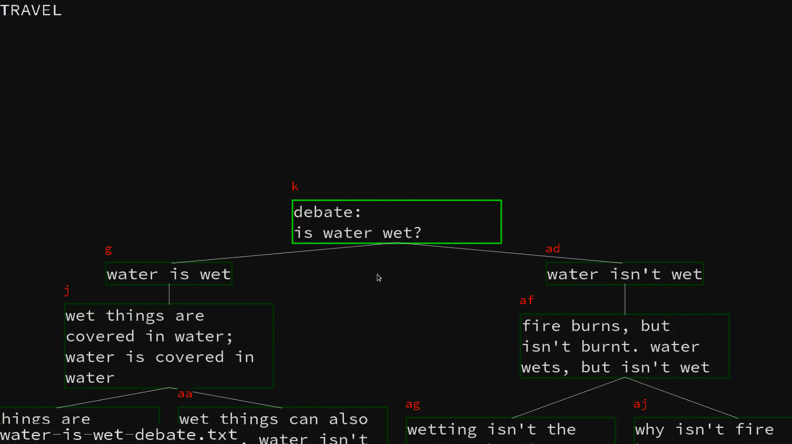

# dtree

A keyboard-driven decision tree editor, for visually exploring spaces of ideas, possible sequences of events, and so much more. [Demo](https://imgur.com/7YwDnxc)



## Usage

The application provides 6 modes of interaction with the decision tree- `Travel`, `MakeChild`, `Edit`, `Delete`, `Cut`, `Paste`.

In Travel Mode:

* `e` : switch to Edit mode
* `t` : switch to Travel mode
* `s` : clear the selected text, then switch to edit mode
* `o` : activate MakeChild mode for one node
* `x` : activate Delete mode for one node
* `m` : activate Cut mode for one node
* `p` : activate Paste mode for one node
* `c` : persist the next mode
* `r` : edit file name
* `t` : open file/url specified by node buffer with xdg-open
* `w` : save file
* `q` : quit the program
* `-` : Zoom out
* `=` : Zoom in

In Any Mode:
    - press `esc` to return to travel mode and switch mode-persist off

In Edit Mode:
    - type to enter text

## Hint Keys and Hint Modes

Some modes allow you to select nodes by entering their corresponding red characters. These characters are called "Hint Keys" and modes that use hint keys to select nodes are called "Hint Modes". The characters `h`, `l`, and `k` always refer to the left node, right node, and parent node of the currently selected node, respectively.

In Travel Mode:

* press hint keys to travel to corresponding node

In MakeChild Mode:

* press hint keys to create a child of the corresponding node

In Delete Mode:

*  press hint keys to delete the corresponding node

In Cut Mode:

* press hint keys to select a node to cut

In Paste Mode:

* select a new parent for the cut node

## Requirements

* SDL2
* SDL2_ttf
* make
* gcc

## Installation

On Arch Linux:

```
pacman -S sdl2 sdl2_ttf
git clone https://github.com/jarbus/dtree
cd dtree
make
```

On Ubuntu

```
apt install libsdl2-ttf-dev
git clone https://github.com/jarbus/dtree
cd dtree
make
```
